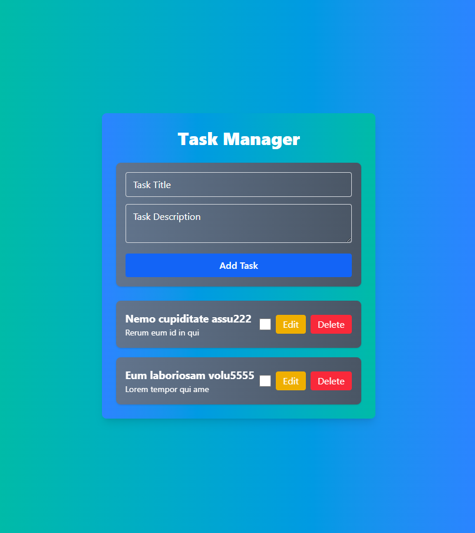
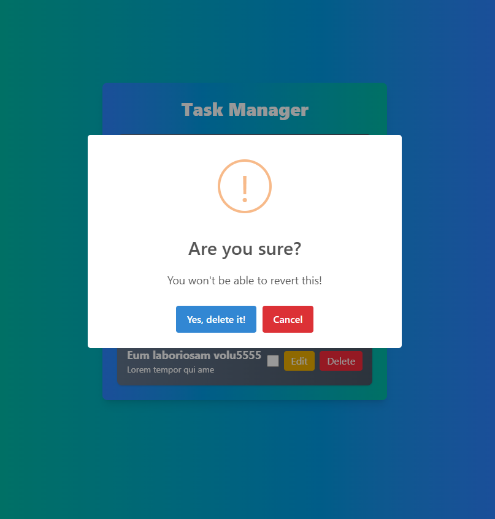
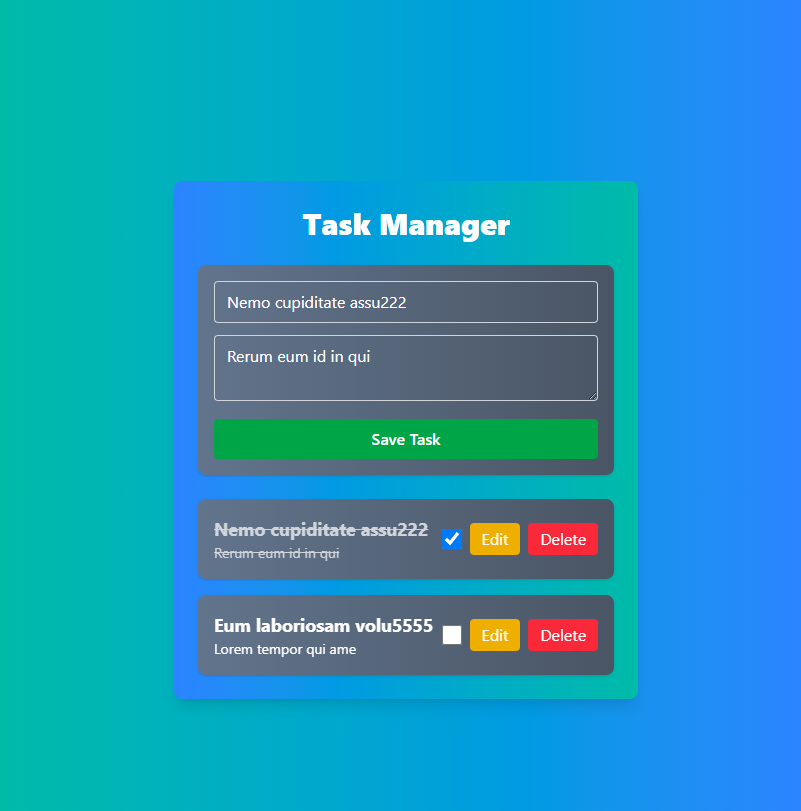
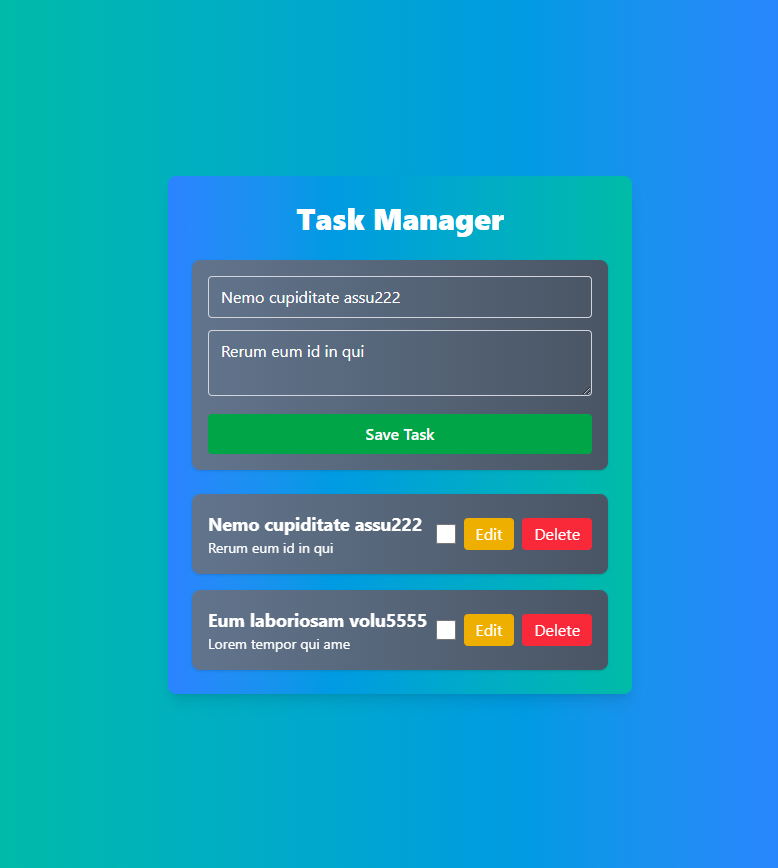

# Task Manager Application

## Live Link

🔗
[Go to Website](https://task-manager-full-stack.netlify.app/)

A full-stack task management application built with Express.js, MongoDB (using Mongoose), and React with Tailwind CSS. This application allows users to create, update, delete, and manage tasks through a visually appealing UI.

---

## Table of Contents

- [Overview](#overview)
- [Installation and Setup](#installation-and-setup)
  - [Backend Setup](#backend-setup)
  - [Frontend Setup](#frontend-setup)
- [API Documentation](#api-documentation)
- [Testing the API](#testing-the-api)
- [Screenshots](#screenshots)
- [License](#license)

---

## Overview

This project demonstrates full-stack development capabilities by integrating a Node.js/Express backend with a React frontend. Tasks are stored in a MongoDB database using Mongoose for data modeling. Features include:

- Create, read, update, and delete tasks
- Responsive UI with Tailwind CSS styling
- RESTful API endpoints for task management
- MongoDB database integration
- Status tracking (Pending/In Progress/Completed)
- Priority levels (Low/Medium/High)

---

## Installation and Setup

### Backend Setup

1. **Clone the repository and navigate to the backend folder:**

   ```bash
   git clone <repository-url>
   cd <repository-folder>/backend
   ```

2. **Install dependencies:**

   ```bash
   npm install
   ```

3. **Create a `.env` file in the backend root directory:**

   ```env
   MONGO_URI=your_mongodb_connection_string
   PORT=5000
   ```

4. **Start the server:**
   ```bash
   npm start
   # For development with hot-reloading:
   npm run dev
   ```

The backend will run on `http://localhost:5000`.

---

### Frontend Setup

1. **Navigate to the frontend folder:**

   ```bash
   cd ../frontend
   ```

2. **Install dependencies:**

   ```bash
   npm install
   ```

3. **Start the development server:**
   ```bash
   npm run dev
   ```

The frontend will be available at `http://localhost:5173`.

---

## API Documentation

### Base URL

`http://localhost:5000/api`

### Endpoints

#### Get All Tasks

- **GET** `/tasks`
- **Response (200 OK):**
  ```json
  [
    {
      "_id": "65f1a2b3c6d12e7f4a8b9c0d",
      "title": "Complete project",
      "description": "Finish the task manager app",
      "dueDate": "2023-12-31",
      "priority": "High",
      "status": "In Progress",
      "createdAt": "2023-10-10T08:00:00.000Z"
    }
  ]
  ```

#### Create Task

- **POST** `/tasks`
- **Required Fields:** `title`
- **Request Body:**
  ```json
  {
    "title": "New Task",
    "description": "Task description",
    "dueDate": "2023-12-31",
    "priority": "Medium"
  }
  ```
- **Success Response (201 Created):**
  ```json
  {
    "_id": "65f1a2b3c6d12e7f4a8b9c0e",
    "title": "New Task",
    "status": "Pending",
    "createdAt": "2023-10-10T09:00:00.000Z"
  }
  ```
- **Error Response (400 Bad Request):**
  ```json
  {
    "error": "Title is required"
  }
  ```

#### Update Task

- **PUT** `/tasks/:id`
- **Request Body:**
  ```json
  {
    "status": "Completed"
  }
  ```
- **Success Response (200 OK):**
  ```json
  {
    "_id": "65f1a2b3c6d12e7f4a8b9c0d",
    "title": "Complete project",
    "status": "Completed"
  }
  ```

#### Delete Task

- **DELETE** `/tasks/:id`
- **Success Response (200 OK):**
  ```json
  {
    "message": "Task deleted successfully"
  }
  ```

---


---

## Testing the API

### Using Postman

1. **Download and Install Postman**
  - Download Postman from [postman.com](https://www.postman.com/downloads/)
  - Install and create a free account

2. **Set Up Environment**
  - Click "New" > "Environment"
  - Name it "Task Manager API"
  - Add variable `base_url` with value `http://localhost:5000/api`
  - Save the environment

3. **Create New Collection**
  - Click "New" > "Collection"
  - Name it "Task Manager"

4. **Add Request Examples**

  #### Get All Tasks
  - Method: GET
  - URL: {{base_url}}/tasks
  - Send request to retrieve all tasks

  #### Create Task
  - Method: POST
  - URL: {{base_url}}/tasks
  - Body (raw JSON):
    ```json
    {
     "title": "Test Task",
     "description": "Testing with Postman",
     "priority": "Medium",
     "dueDate": "2024-12-31"
    }
    ```

  #### Update Task
  - Method: PUT
  - URL: {{base_url}}/tasks/:id
  - Replace `:id` with actual task ID
  - Body (raw JSON):
    ```json
    {
     "status": "Completed"
    }
    ```

  #### Delete Task
  - Method: DELETE
  - URL: {{base_url}}/tasks/:id
  - Replace `:id` with actual task ID

5. **Test the Endpoints**
  - Select the "Task Manager API" environment
  - Run requests in sequence to test CRUD operations

---

  
_whole app : add task form with task list_

  
_delete confirmation dialogue_

  
_Checked a task (completed)_

  
_Update a task_

---
